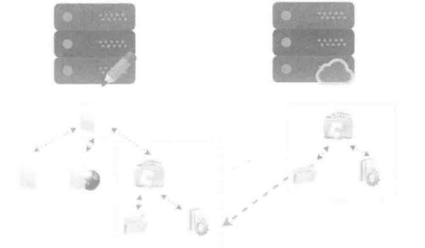

# 文件系统基础

[TOC]

## 1. 设备驱动程序

针对输入输出设备，操作系统都把它们抽象成了寄存器（status，control and data）模型。

针对设备驱动程序，其所承担的责任就是把 system call 翻译成与**设备寄存器**的交互。由于设备驱动程序是各个厂商自己实现的，所以也是整个 Linux 系统中代码质量最低的部分。

任何设备本身为上层提供服务时，可以抽象出三个功能：read，write and ioctrl。编写设备驱动程序本身也是实现上述的三个目的对象，把文件操作翻译成设备控制协议，调用设备实现的 file_operations。

在 jyy 老师的课上，Linux 万物皆 file，设备也是一个 file，如果我想为我的设备写一个设备驱动程序，我就只用实现这个设备的 file_operations，所以在 Linux 目录中 /dev 的设备并不一定是一个真实存在的设备。在一个真正的驱动程序例子“核弹发射”中，设备可以被虚拟出来的。

## 2. 什么是文件系统

### 2.1 文件系统概念

文件系统定义：

1. 存储、管理、控制、保护计算机系统中持久数据的软件模块。
2. 存储在外存的具有某种组织结构的数据集合。

通常我们所说的文件系统是构建在硬盘（SSD 和 SD卡等）中的，文件系统其实就是一个对硬盘（或者对块设备）空间进行管理，实现数据存取的软件系统，文件系统最重要的功能也就是**实现设备在应用程序之间的共享**。


底层是硬件设备，这里以硬盘为例。中间层是**硬盘驱动器**和**操作系统**把硬盘抽象为的一个连续的线性空间。顶层是文件系统，将线性空间进行管理和抽象，呈现给用户一个层级结构。这里的层级结构就是我们平常看到的目录、子目录和文件等元素的集合，即目录树。

- 从普通用户的角度来看，文件就是一个线性空间，这就好比程序开发中的数组一样。与数组不同的是文件的大小是可以变化的，当写入更多的数据时，文件的容量就会变大。
- 从操作系统角度来说，文件系统则主要实现对硬件资源的管理,也就是对磁盘资源的管理。

这时想起jyy老师讲过的一段话：文件其实就是一个虚拟的磁盘，即具有动态可变化的容量，是一个可以读/写的动态字节序列。为了更有效的存储文件，将文件分为很多的逻辑块，从用户的角度来看，这些逻辑块是线性的、连续的，但从文件系统的层面来看，文件的逻辑块在磁盘中的物理地址并不固定。

到这里我们可以理解文件系统的本质上就是“存储设备（字节序列）的虚拟化”，其设计目标：

- 提供合理的 API 使多个程序共享data
- 提供一定的隔离，遏制 bug 的扩散

文件系统本身自然而然地因多个程序需要共享数据而产生的抽象，也就是前面所阐述的文件系统最重要的目标。

此时我们又想到系统中有那么多文件，该如何将虚拟磁盘组织成层次结构？

其实文件系统不仅可以构建在磁盘上，它还可以构建在任何块设备上，甚至网络上。在 Linux 中，最常见的块设备包括裸磁盘、分区、LVM 卷和 RAID 等。我们可以对上述任何块设备进行格式化，构建文件系统。Windows 中的文件系统也是可以构建在其卷组上的。最 crazy 的是，甚至可以构建在文件上。这里举出两种挂载文件系统的例子：

1. 使用 mkfs 命令构建一个文件系统，并对文件系统进行格式化，用 dumpe2fs 命令获取文件系统的描述信息。
2. 借助 Linux 的循环设备（回环设备），通过该循环设备可以将一个文件虚拟成块设备，然后将该块设备挂在到目录树中（lsblk，strace）。

```shell
losetup /dev/loop10 ./img.bin
mkdir /tmp/ext2
mount /dev/loop10 /tmp/ext2
```

这时，jyy 老师挂载了一个文件系统，可以把任何设备的文件系统挂在到任何一个目录下面，即目录树的拼接，顺利的引出 Linux 的启动过程：扫描存储设备。注意，文件的挂载引入了一个微妙的循环：

- 文件 = 磁盘上的虚拟磁盘  
- 挂载文件 = 在虚拟磁盘上虚拟出的虚拟磁盘。

> **开机启动过程**，串联了 jyy 老师和网络上的解答，在后面解释 VFS（virtual file system）后解答。

### 2.2 文件系统基本原理

前文从用户角度和操作系统角度分别对文件系统进行了介绍,可以知道文件系统实现了对磁盘空间的管理，并提供了便于使用的接口。本节介绍一下文件系统的基本原理。

要想理解文件系统，先要从磁盘说起，毕竟文件系统是构建在磁盘中的。虽然磁盘的内部非常复杂，但是磁盘厂商做了很多工作，将磁盘的复杂性掩盖起来。对于普通用户来说，磁盘就是一个线性空间，就好像 C 语言中的数组一样，通过偏移就可以访问其空间（读/写数据）。

以 Ext4文件系统为例，它将磁盘空间进行划分。首先将磁盘空间划分为若干个子空间，这些子空间称为**块组**。然后将每个子空间划分为等份的**逻辑块**。这里逻辑块是最小的管理单元，逻辑块的大小可以是 1KB、2KB 或 4KB 等，由用户在格式化时确定。


为了管理这些逻辑块，需要一些区域来记录哪些逻辑块已经被使用了，哪些还没有被使用。记录这些数据的数据通常在磁盘的特殊区域，我们称这些数据为文件系统的元数据（Metadata），如图中的数据块位图和 inode 位图等。通过元数据，文件系统实现了对磁盘空间的管理，最终为用户提供了简单易用的接口。

至此对文件系统的基本原理有了一个感性的认识。

### 2.3 常见文件系统及分类

目前，常见的文件系统有几十个。虽然文件系统的具体实现形式纷繁复杂，具体特性也各不相同，但是有一定规律可循。下面将介绍一下常见的文件系统都有哪些种类。

通过前文我们了解了基于磁盘的本地文件系统，对其基本原理也进行了简要的介绍。其实文件系统发展到现在，其种类也丰富多样。比如，基于磁盘的普通本地文件系统除了 Ext4，还包括 XFS、ZFS 和 Btrfs 等。其中 Btrfs 和 ZFS 不仅可以管理一块磁盘，还可以实现多块磁盘的管理。不仅如此，这两个文件系统实现了数据的冗余管理，这样可以避免磁盘故障导致的数据丢失。

除了对磁盘数据管理的文件系统，还有一些网络文件系统。也就是说，这些文件系统看似在本地，但其实数据是在远程的专门设备上。客户端通过一些网络协议实现数据的访问，如 NFS 和 GlusterFS 等文件系统。经过几十年的发展，文件系统的种类非常多，我们没有办法逐一进行介绍。本节就对主要的文件系统进行介绍。

#### 2.3.1 本地文件系统

本地文件系统是对磁盘空间进行管理的文件系统，也是最常见的文件系统形态。从呈现形态上来看，本地文件系统就是一个树形的目录结构。本地文件系统本质上就是实现对磁盘空间的管理，实现磁盘线性空间与目录层级结构的转换。

从普通用户的角度来说，本地文件系统主要方便了对磁盘空间的使用，降低了使用难度，提高了利用效率。常见的本地文件系统有 Ext4、Btrfs、XFS 和 ZFS 等。

#### 2.3.2 伪文件系统

伪文件系统（Pseudo File System）是 Linux 中的概念，它是一种特殊类型的文件系统，也是对传统文件系统的延伸。**伪文件系统并不会持久化数据，不像传统的文件系统那样直接存储在物理存储设备上，而是内存中的文件系统。它将抽象的概念、状态或操作映射为文件和目录的形式，以便用户和程序可以通过标准的文件 I/O 操作来访问和操作这些抽象实体。**。即它是以**文件系统的形态实现用户与内核数据交互的接口**。常见的伪文件系统有 `/proc`、 `/sysfs` 和 `/configfs` 等。

在 Linux 中，伪文件系统主要实现内核与用户态的交互。它允许用户和系统工具以一种统一的方式获取系统状态、配置信息以及与内核交互，而不需要直接访问内核数据结构或执行系统调用，也不需要了解内核内部的实际数据结构和机制。比如，我们经常使用的 iostat 工具，其本质上是通过访问 `/proc/diskstats` 文件获取信息的。而该文件正是伪文件系统中的一个文件，但其内容其实是内核中对磁盘访问的统计，它是内核某些数据结构的实例。

在 Unix-like 操作系统（如 Linux） 系统中，有一些常见的伪文件系统，包括：

- `/proc`： 这是进程信息的伪文件系统，提供了关于正在运行的进程和内核状态的信息。通过访问 `/proc` 目录下的文件，可以获取到诸如进程 ID、内存使用情况、CPU 信息等的数据。
- `/sys`： 这是设备和驱动程序信息的伪文件系统，提供了对内核中设备和驱动程序的配置和控制接口。可以通过 `/sys` 目录下的文件来管理和控制硬件设备的状态。
- `/dev`： 尽管 `/dev` 目录通常用于存放设备文件，但在某种程度上这些设备文件也可以看作是一个伪文件系统，因为它提供了访问设备的方式，使得用户和程序可以通过文件 I/O 操作来与设备进行交互。

其中，`/dev` 目录下的设备文件这一部分对应了上面提到了 losetup 部分，在 Unix-like 操作系统中，设备文件用于与系统硬件设备和内核模块进行通信。这些设备文件允许用户和应用程序使用标准的文件 I/O 操作来与设备进行交互，就像操作常规文件一样。然而，设备文件并不一定与物理存储中的实际文件相对应。这种设备文件的存在可以被视为一种“伪文件系统”，因为它提供了一种抽象接口，让用户能够以文件的形式来访问和控制设备。这种抽象使得用户不必直接了解硬件细节，而是通过标准的文件操作来进行设备通信。设备文件在操作系统内部可能会通过底层的驱动程序与实际硬件通信，但对于用户和应用程序来说，这一切都被抽象起来，以便使用方便。

这些伪文件系统的存在使得用户和开发人员能够更方便地获取系统和内核的信息，而不需要直接处理底层的数据结构或系统调用。伪文件系统的概念为操作系统提供了更高层次的抽象，使得系统状态的监测和配置更加便捷。

#### 2.3.3 网络文件系统

网络文件系统是基于 TCP/IP 协议（整个协议可能会跨层）的文件系统，允许一台计算机访问另一台计算机的文件系统，就如访问本地文件系统一样。网络文件系统通常分为客户端和服务端，其中客户端类似本地文件系统，而服务端则是对数据进行管理的系统。网络文件系统的使用与本地文件系统的使用没有任何差别，只需要执行 mount 命令挂载即可。网络文件系统也有很多种类，如 NFS 和 SMB 等。

在用户层面，完成挂载后的网络文件系统与本地文件系统完全一样，看不出任何差异，对用户是透明的。网络文件系统就好像将远程的文件系统映射到了本地。如图所示，左侧是客户端，右侧是文件系统服务端。



通过上图可以看到，当在客户端对服务端导出的文件系统进行挂载后，服务端的目录树就成为客户端目录树的一颗子树。这个子目录对普通用户来说是透明的，不会感知到这是一个远程目录，但实际上读/写请求需要通过网络转发到服务端进行处理。

#### 2.3.4 集群文件系统

集群文件系统本质上也是一种本地文件系统，只不过它通常构建在基于网络的 SAN 设备上，且在多个节点中共享 SAN 磁盘。集群文件系统最大的特点是可以实现客户端节点对磁盘介质的共同访问，且**视图具有一致性**。

这种视图的一致性是指，如果在节点 0 创建一个文件，那么在节点 1 和节点 2 都可以马上看到。这个特性其实跟网络文件系统类似，网络文件系统也是可以在某个客户端看到其他客户端对文件系统的修改的。

但是两者是有差异的，集群文件系统本质上还是构建在客户端的，而网络文件系统则是构建在服务端的。

同时，对于集群文件系统来说，其最大的特点是多个节点可以同时为应用层提供文件系统服务，特别适合用于业务多活的场景，通过集群文件系统提供高可用集群机制，避免因为宕机造成服务失效。

#### 2.3.5 分布式文件系统

从本质上来说，分布式文件系统其实也是一种网络文件系统。在《计算机科学技术名词》中给出的定义为“一种文件系统，所管理的数据资源存储在分布式网络节点上，提供统一的文件访问接口”，可以看出，分布式文件系统与网络文件系统的差异在于服务端包含多个节点，也就是服务端是可以横向扩展的。从使用角度来说，分布式文件系统的使用与网络文件系统的使用没有太大的差异，也是通过执行  mount 命令挂载，客户端的数据通过网络传输到服务端进行处理。

### 2.4 virtual file system

**场景一**：在操作系统中，如果客户端连接了很多存储设备，如 HDD、不同厂商的 SSD 和 U 盘等，这时如果两个设备上的数据想进行交互，需要操作系统作为二者的媒介，但是由于不同类型设备的文件系统标准和接口不同，直接交互就会给操作系统带来很大的困，这时就需要操作系统再抽象一个中间层作为二者交互的媒介。

**场景二**：当操作系统上层的用户想对设备进行读/写操作，由于各个设备的文件系统接口不同，这就给开发者带来了很大的困扰。

基于场景一和场景二，操作系统设计了一个文件系统的中间层。前面我们提到的文件系统其实是真实构建在块设备、网络等实体上，但文件系统层其实包含了上层和下层，真实构建的文件系统存在于文件系统层的下层，也被称为实际文件系统（Real File System）。而这个中间层，就是文件系统层的上层，也就是**虚拟文件系统**（Virtual File System，VFS）。

- **虚拟文件系统（Virtual File System，VFS）**：
虚拟文件系统是操作系统内核中的一个抽象层，它提供了一个统一的文件系统接口，使应用程序可以通过相同的方式访问不同的实际文件系统，而不必关心底层的文件系统类型。VFS 允许操作系统将不同的实际文件系统映射到一个通用的文件系统接口上，从而使应用程序可以透明地与文件进行交互，而不必关心实际文件系统的差异。
- **实际文件系统（Real File System）**：实际文件系统是指实际存储设备上的文件系统，它是在物理硬件上进行的文件存储和管理。不同的文件系统（例如：FAT32、NTFS、EXT4 等）定义了在存储设备上如何组织和存储文件的方式，包括文件的布局、目录结构、索引方式等。实际文件系统负责将文件数据写入物理存储设备的特定位置，并提供对文件的读取、写入、删除等操作。

下图是 Linux 工作过程中的抽象视图，上层用户都直接和 VFS 打交道，文件系统开发者再把 VFS 转换为自己的格式。这样做的优点主要有：

1. 用户层应用不用关心具体用的是什么文件系统， 使用统一的标准接口进行文件操作；
2. 如果一个系统包含不同分区，不同分区使用不同的文件系统，他们之间可以通过这个VFS交互，比如从 U盘、网盘拷数据到硬盘就得通过 VFS 转换管理信息；
3. 可以动态支持很多文件系统，添加一个只需要安装驱动就可以了，不需要内核重新编译。


- **用户层**：最上面用户层就是我们日常使用的各种程序，需要的接口主要是文件的创建、删除、打开、关闭、写、读等。
- **VFS 层**：我们知道Linux分为用户态和内核态，用户态请求硬件资源需要调用System Call通过内核态去实现。用户的这些文件相关操作都有对应的System Call函数接口，接口调用 VFS对应的函数。
- **文件系统层**：不同的文件系统实现了VFS的这些函数，通过指针注册到VFS里面。所以，用户的操作通过VFS转到各种文件系统。文件系统把文件读写命令转化为对磁盘LBA的操作，起了一个翻译和磁盘管理的作用。
- **缓存层**：文件系统底下有缓存，Page Cache，加速性能。对磁盘LBA的读写数据缓存到这里。
- **块设备层**：块设备接口 Block Device 是用来访问磁盘 LBA 的层级，读写命令组合之后插入到命令队列，磁盘的驱动从队列读命令执行。Linux设计了电梯算法等对很多LBA的读写进行优化排序，尽量把连续地址放在一起。

> 回答 [**2.1**](#21-文件系统概念) 中的问题：
>
> 在开机启动时，操作系统会启动并初始化各个子系统，其中包括 VFS（虚拟文件系统）的初始化。VFS 在系统运行过程中抽象出了对文件系统的访问，并通过真实文件系统来管理存储设备上的文件和数据。以下是在开机启动时 VFS 是如何抽象文件系统和进行初始化的简要过程：
>
> - **启动引导阶段**：
> 在计算机开机时，启动引导加载程序（Bootloader）负责初始化硬件设备、加载操作系统内核和初始化引导过程。引导加载程序通常从引导设备（如硬盘、固态硬盘等）中加载操作系统内核，这时加载的内核是启动机器所需的最小部分。
> - **内核初始化阶段**：
> 一旦操作系统内核被加载，内核开始执行初始化操作。在这个阶段，VFS 开始初始化，建立虚拟文件系统的抽象层。
> - **VFS 初始化**：
> VFS 初始化的主要目标是为应用程序提供一个通用的文件系统访问接口，使它们可以透明地与不同类型的真实文件系统进行交互，而不必关心底层文件系统的差异。
> - **文件系统驱动加载**：
> 操作系统通常支持多种不同类型的真实文件系统，如 FAT、NTFS、EXT 等。在 VFS 初始化阶段，相应的文件系统驱动会被加载并注册到 VFS 中，以便在需要时与应用程序进行交互。
> - **设备驱动加载**：
> 在开机过程中，操作系统还会初始化硬件设备的驱动程序，包括存储设备的驱动。这些驱动程序允许操作系统与硬件设备进行通信，从而进行数据的读取和写入。
> - **文件系统挂载**：
> 一旦文件系统驱动和设备驱动被加载，操作系统可以根据需要挂载（Mount）真实的文件系统。这意味着将存储设备上的文件系统与 VFS 的抽象进行关联，使得文件和目录能够通过 VFS 进行访问。
> - **文件系统操作**：
> 一旦文件系统被挂载，操作系统中的应用程序和服务可以使用 VFS 提供的统一接口来进行文件操作，包括读取、写入、创建、删除等。
>
> 经历了上述过程之后，也会更好的理解目录树是怎么搭建的。

最后，注意伪文件系统和 VFS 的区别，同时也要认识到 VFS 作为抽象层，并不具备持久化。

## 3. 构建于设备上文件系统的 I/O 细节

在计算机发展的过程中，底层存储的主流的发展历程为：磁鼓和磁带 -> HDD -> SSD -> 新型存储介质。在计算机大规模爆发时期，HDD 在那个时期是主要的存储设备，上层软件栈主要针对机械硬盘（HDD）进行了优化和设计。因此许多应用程序、操作系统和文件系统都考虑了机械硬盘的特点和限制来进行开发。然而，随着技术的进步，固态硬盘（SSD）等新型存储介质的出现逐渐改变了存储设备的格局。由于SSD在访问速度、能效和耐久性方面的优势，现代上层软件栈也需要针对这些新型存储设备进行优化。因此，随着底层存储技术的演进，上层软件栈的设计和优化也在不断变化，以充分发挥不同存储介质的优势。

在各大厂商存储系统中使用的主流设备从 HDD 过渡到 SSD 的过程中，其 I/O 流程也悄然发生着变化。

HDD 使用磁性存储技术来存储数据，并且在物理上包含一个或多个旋转的磁盘（也称为碟片）以及读/写磁头等组件，其基本工作原理是这样的：

- **碟片（Platters）**：机械硬盘内部包含一个或多个圆形的碟片，通常由金属或玻璃材料制成。每个碟片都被涂覆上磁性材料，可以在其表面存储数据。
- **读/写磁头（Read/Write Heads）**：每个碟片的两个表面都有一个磁头，用于读取和写入数据。这些磁头位于一个可以在碟片上移动的臂上，从而能够在不同的磁道上进行读写操作。
- **磁道和扇区**：每个碟片的表面被划分为多个同心圆的磁道，每个磁道进一步被划分为扇区。数据以磁性位（0 或 1）的形式存储在磁道上的扇区中。
- **旋转和寻道**：碟片会以高速旋转，使得读/写磁头能够在磁道上寻找特定的数据。这个寻找数据的过程称为寻道。
- **数据读写**：当磁头定位到特定的磁道和扇区时，它可以读取或写入磁道上的数据。在写入数据时，磁头会改变磁性材料的磁性状态，以编码数据。

前面我们提到厂商编写的设备驱动程序会将块设备抽象成连续的线性空间给上层提供服务，这时线性空间上的逻辑块需要和 HDD 中物理块做一次映射，设备内的文件系统使用逻辑块号到物理块号的映射来管理数据存储。这个映射过程是文件系统的一部分，用于将逻辑块号（在文件系统内部使用的块编号）映射到物理块号（在磁盘上的实际块编号），从而实现数据的读写和管理。

当主流产品更换为 SSD 时，为了屏蔽底层设备的差异，兼容上层软件栈，SSD 需要将自身抽象成 HDD，这时就需要 FTL 来隐藏 SSD 中 out-of-place update 的特性和 HDD 中的差异。这时就涉及到两个层次的映射：文件系统层面的逻辑块号到虚拟物理块号的映射，以及SSD内部的Flash Translation Layer（FTL）层面的虚拟物理块号到实际物理块号的映射。这两个映射层次是为了实现更好的性能、寿命和数据管理。

## 总结

操作系统通过设备驱动程序，将硬件设备五花八门的“寄存器协议”抽象成了统一的接口（即前面提到的虚拟磁盘 -> file_operation），并且通过挂载进而成为目录树的一部分。UNIX “一切皆文件” 的设计使得应用程序可以自由访问各类设备，但带来的代价是 File system 部分巨大的历史包袱和移植性问题。
