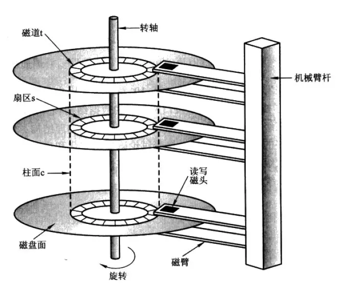

# Disk Spindle

7200 RPM, 120 Hz, 8.33ms/rotation.

Rotational latency: 4.17ms average.

Seek time: didn't improve for years.

Video: https://youtu.be/3owqvmMf6No

Elevator algorithm for disk-scheduling. Native Command Queuing (NCQ).

Database transactions must be aware of this.

