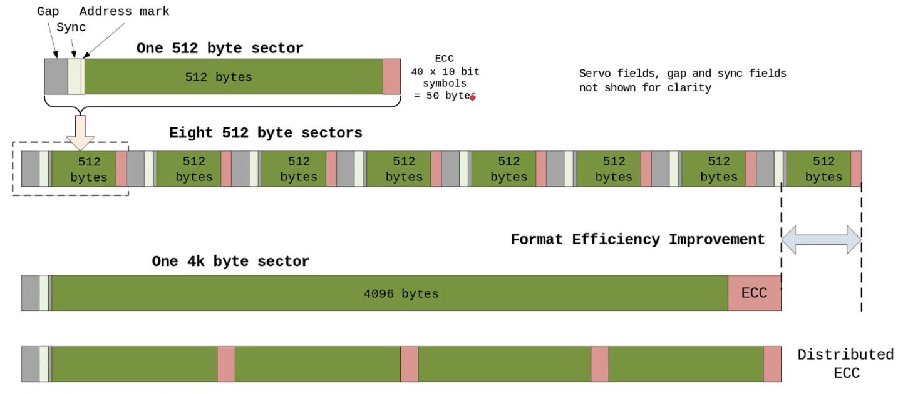
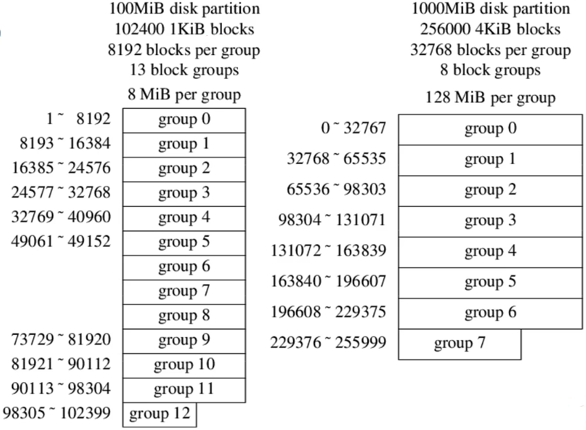

# Blocks and block groups

- 1988, 512B -> 1KB
- 2001, 1KB -> 2KB
- 2011, 2KB -> 4KB

## 1. Block allocation: bitmap to find free blocks

Both file system and file are allocated in block units, not in bytes.

Getting free space (free blocks) of a file system is O(1), it's kept in the superblock.

数一个目录下占了多少空间很慢，因为要遍历一遍

Block bitmap is 1 block, so it's 8192 blocks per group for 1KiB block, 32768 for 4KiB.

- On 1KiB block file system, an 100B file uses the same disk space as 1000B file.
- On 4KiB block file system, any non-empty regular file smaller than 4K uses 4K space.
- Usually, an empty directory uses 4K disk space, not including its inode.
- Inline data: e.g. symbolic link shorter than 60B can be put in inode blockmap.

## 2. Block size affects performance

Larger block size:

- Less metadata overhead
- Higher throughput

Smaller block size:

- Space efficiency, 1-byte regular file uses 1 block. (O-byte file uses 0 blocks)

### 2.1 Disk sector size vs. block size vs. page size

Sector is physical, 512B before 2010, 4K since then. But there's 512e and 4Kn

Recent mke2fs checks logical sector size and physical sector size when calc blocksize.

Block is logical, as seen by filesystem

512B in 1970s, 1024 for 1980s ~1990s. Linus had a 40MB disk in 1991.

Default to 4096 since ~2000, Linux 2.4. 1.2GB disk was common in 1996, 17GB in 1999.

E2FSPROGS-1_15(1999-07-20), 1k block for small filesystem < 512M, 4k for larger.

**Sector size <= block size <= memory page size, now they are all 4K, a magic number.**

为什么提出 sector 的大小从 512B 到 4K？



简单来说，处于经济因素。

### 2.2 Max filesystem size

$$
\text{Max filesystem size: }block size * 2^{\text{block number bits}}
$$

For 32-bit block numbers (Ext2), max 4,294,967,296 blocks

- 1KiB block  4TiB max   Actual is 2047MiB, due to block group limit.
- 2KiB block  8TiB max
- 4KiB block  16TiB max

For 48-bit block numbers (Ext4), max 281,474,976,710,656 blocks

- 4 KiB block  max 1EiB = 1024 PiB= 104,8576 TiB

But, there's 256TiB limit due to block groups, 128MiB per group, 2M groups

https://kernel.org/doc/html/v6.0/filesystems/ext4/overview.html#meta-block-groups

For 64-bit block numbers,...

现在的硬盘大小已经足够大了，再大就不太友好了，而且可能会提高故障率

## 3. Block groups



Better locality for metadata and file content. 分组本质上就是把一个文件系统分成更小更多的文件系统，也就意味着在有限的小空间里分配文件，可以让磁盘磁头跳转距离变短，提升性能。

Ext2 max group size 128 MiB:

- 1 block for bitmap
- 32768 bits per 4KiB blk
- 32768 blocks per group
- 32Ki*4KiB = 128MiB

1TB partition: 7000+ groups

Group descriptor

```C
/*
* Structure of a blocks group descriptor
*/

struct ext2_group_desc
{
    _u32 bg_block_bitmap;       /* Blocks bitmap block*/
    _u32 bg_inode_bitmap;       /* Inodes bitmap block*/
    __u32 bg_inode_table;       /* Inodes table block*/
    __u16 bg_free_blocks_count; /*Free blocks count*/
    __u16 bg_free_inodes_count; /*Free inodes count */
    __u16 bg_used_dirs_count;   /* Directories count*/
    __u16 bg _pad;
    _u32 bg_reserved[3];
};

static_assert(sizeof(ext2_group_desc) == 32,"");
```

Ext2 group descriptor is 32B. 它没有提到这个 group 开始在哪里，也没有说一个 group 有多大，这些全都在 superblock 隐式推算出来的。

Ext4 is 64B, for 48-bit block id, 32-bit free blocks/inodes count, and checksums, etc.

For 1KiB blk ext2, 1 block contains 32 group desc, map to 256MiB disk.

max 8192*256MiB = 2048GiB，group_desc 需要放在一个 group 中

For 4KiB blk ext4, 1 block contains 64 group desc, map to 8192 MiB.

Fragments and Clusters

Ext2 and FFS supports fragments for files smaller than a block.

- A fragment is 1/2 or 1/4 of a block, minimal 1KiB.
- Rarely used nowadays. I doubt if it was ever widely used in the past.

Ext4 seems replaces it with clusters, the

- For a filesystem of mostly huge files, it is desirable to be able to allocate disk blocks in units of multiple blocks to reduce both fragmentation and metadata overhead.The bigalloc feature provides exactly this ability.
- https://kernel.org/doc/html/v6.0/filesystems/ext4/overview.html#bigalloc

In this course, we consider block_size = fragment_size = cluster_size for simplicity.

Block size is important to filesystem

But you can't do much about it:

disk sector size <= filesystem block size <= memory page size

4 KiB is most common for all three sizes above.

Block groups improve locality and throughput for HDD, **not very useful for SSD (IMO).**

Superblock and group descriptors are backed up in some groups.
