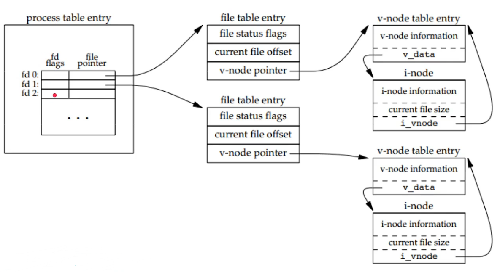
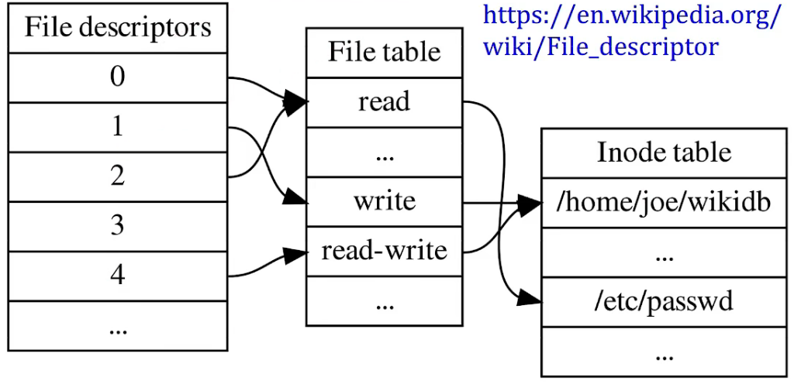

# x

inode: core representation of file on disk

Must have:

- mode (type + permissions)
- size in bytes
- reference count (nlink)
- block addresses

Must not have:

- file name（例如 A 和 B 指向同一个文件，本质上 inode 是一样的；实际修改文件名修改的目录的目录项 ）

Optional:

- timestamps (atime, ctime, mtime)
- uid/gid
- minor/major device numbers

inode number is unique within one filesystem

- hard-link can't cross filesystem
- soft-link (symbolic link) can

内核中的进程打开两个文件后，创建的数据结构：

[Linux文件描述符演变](https://zhuanlan.zhihu.com/p/34280875)

知道了上述三级结构有什么意义呢，现在有一个场景帮你理解：

Web server opens fileaccess. log for writing.
A develop run 'less access.log' to read.

They should see the same file size, but different file offsets.

Unix file descriptors

Three levels:

1. file descriptor table，放在进程里面，每个进程有自己的 file descriptor table，但是线程看到的是一样的。
2. file entry table, w/file offset
3. inode table, w/file size

File descriptor flags

Only FD_CLOEXEC, dup(2) doesn't preserve the flag.

File status flags: O_NONBLOCK, O_APPEND,O_ASYNC,O_DIRECT, O_NOATIME, etc.

dup(2)/fork(2) preserve flag value

一个进程能打开多少文件是由 File descriptor table 决定的。

整个机器/操作系统内核能打开多少文件是由 File table 决定的

open(2) twice vs. open(2) then dup(2)/fork(2)

File descriptor table is per process.File table and inode table are global.

File current offset is in file table, file current size is in inode table.

Same inode, so same lock to acquire when modify file state.

open(2) twice: two file table entries,each FD has its own offset, no interfere

open(2) then dup(2), one file table entry, two FDs point to the same file object

open(2) then fork(2) , two FDs point to the same file object, share the same offset.
