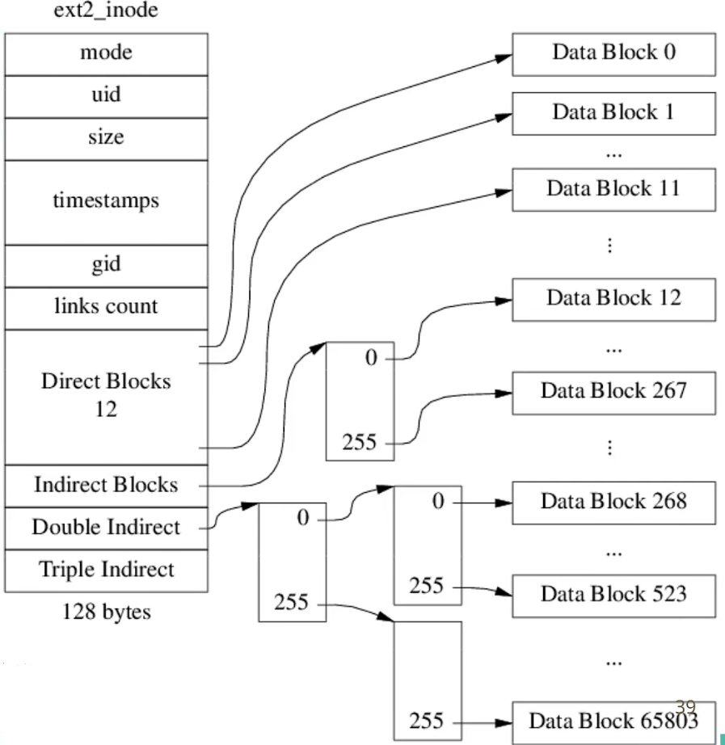
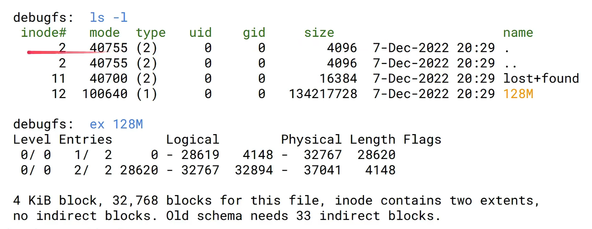
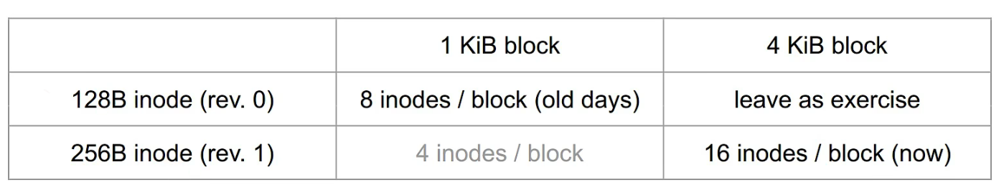
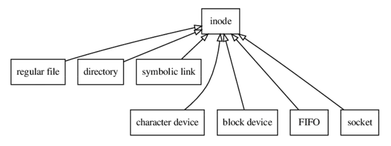

# inode

## 1. ext2_inode



sizeof(struct ext2_inode) == 128，即一个 inode 大小是 128B

8 inodes per 1KiB block

32-bit inode number, 256 inode number per 1KiB indirect block

$$
\text{Max file blocks on 1KiB block disk} = 12+ 256 + 256^2+ 256^3 = 16,843,020
$$

Max file size = 16,843,020 KiB = ~16.063GiB

Ext2 is good for small files, like source code, a few dozens KB.Not optimal for images/videos.

For 128MiB file on 1KiB block ext2 FS:

131,072 data blocks, 515 indirect blocks

1 indirect block, up to 268 KiB

256 + 1 double indirect blocks, up to 65804 KiB

255 + 2 triple indirect blocks, remaining 65268 KiB

60B 用来存放 Direct blocks~ triple blocks

File is appendable, but not easy-insertable

From the block mapping mechanism, we know that:

1. it's easy to append a new block at the end of a file
2. it's hard to insert a byte in the middle of a file
a. just like insert in the middle of an array.
3. it's possible to insert a block in the middle of a file
    a. only to change some indirect blocks, not data blocks
    b. but file system doesn't export such operators
    c. files are abstract like byte streams, not block streams.

file size != disk usage, often disk usage is larger due to overhead, occasionally smaller for sparse files. (open a file, lseek to 1MiB, write 1KiB.) For Ext4, blocks of zero bytes doesn't consume disk space. dd if=/dev/zero of=file bs=1M count=1800

## 2. Ext4 uses extent tree, not indirect blocks

https://en.wikipedia.org/wiki/Ext4#Features

Extents replace the traditional block mapping scheme used by ext2 and ext3. **An extent is a range of contiguous physical blocks**, improving large-file performance and reducing fragmentation.

A single extent in ext4 can map up to 128 MiB of contiguous space with a 4 KiB block size.[4]

There can be four extents stored directly in the inode. When there are more than four extents to a file, the rest of the extents are indexed in a tree.[14]

Ext4 extent examined

Here's an single-level example, extent can also form a tree.



## 3. Ext2 vs. Ext4 inodes

Number of inodes is fixed, 'df -i' to find usage.Most people cares free disk space only.

小文件占inode，大文件占 storage

If too many small files, you could run out of inodes before filling up the disk.


## 4. Revision 1 of Ext2

Ext2 is first integrated into Linux 0.99.7(1993-3-13)

New features of revision 1:

dynamic inode size (256B is new common)

Support added in Linux 1.3.98 (1996-05-04)



Max file size 的计算方法

## 5. inode = file

File system impl.file API from block device, inode maps a file to its data blocks.

inode stores file metadata, including:

- file size
- refcount (nlink)
- block addresses (indirect blocks or extents)
- mode (permissions), timestamps, etc.



But not including:

- file name
- file offset

Filesystem abstraction refined

```C++
class FileSystem
{
    public:
        using inode_num_t = uint32_t;
    
        explicit FileSystem(BlockDevice* dev);
    
        inode_num_t lookup(string_view path);
    
        shared_ptr<Inode> getInode(inode_num_t);
    
    private:
        BlockDevice* dev_;
        SuperBlock sb_;
        Map<string, inode_num_t> dirs_;
        Array<Inode> inodes_;
};

struct Inode
{
    using block_num_t = uint64_t;
    bool isDir( ) const;
    bool isFile() const;
    bool isSymLink( ) const;

    int64_t file_size;
    int ref_count ;

    block_num_t getBlockNum(uint32 idx);
    bool appendBlock(block_num_t blk); #dev

    private:
        Vector<block_num_t> blocks; // two ways};
}
```
