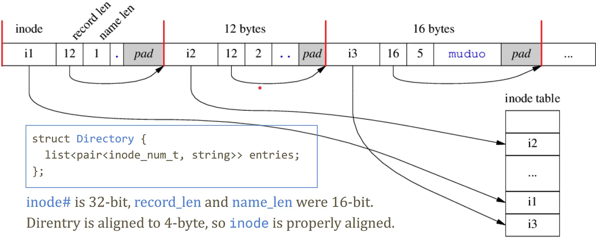
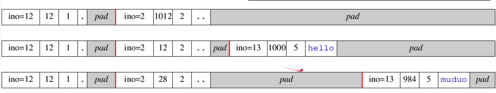

# Directory

Directory is a special kind of file.

lt maps filename to inode number.

## 1. File hierarchy (directory)

File system in 1960s doesn't support sub-directory, everything in root directory.

Classic Unix 1974 paper's Abstract: It offers a number of features seldom found evenin larger operating systems, including:

1. a hierarchical file system incorporating demountable volumes;
2. compatible file, device, and inter-process I/O; (everything is a file)
3. the ability to initiate asynchronous processes; // fork(2)
4. system command language selectable on a per-user basis; and // shell
5. over 100 subsystems including a dozen languages.

Directory entries are linked list in old times



## 2. ext2_dir_entry_2

```c
struct ext2_dir_entry_2{
    _le32 inode;    // Inode number
    _le16 rec_len;  // Directory entry length
    _u8 name_len;   // Name length
    _u8 file_type;  // New in v2
    char name[];    // File name, up to 255
};
typedef struct ext2_dir_entry_2_ext2_dirent;

```

举一个小例子：

```shell
$ touch hello
$ mv hello muduo
```



```c
de = (ext2_dirent *)((char *)de + rec_len); // next
```

Dir entry won't cross block boundary.

Modify an ext2 directory, linear time operation

修改文件系统接口：抽象的 API

```
Create an entry (file or sub directory)
    First-fit algorithm     ext2_new_inode()
    lookup_open() -> ext2_create() ->  ext2_add_nondir() -> ext2_add_link()

Remove an entry (file or empty directory)
    Set inode number to 0, merge it with previous entry
    vfs_unlink() ->ext2_unlink() -> ext2_delete_entry()

Rename an entry in the same directory
    Create then remove, two linear search, might delete the target first if exists.
    vfs_rename0 -> ext2_rename():
        ext2_find_entry(), ext2_add_link(), ext2_delete_entry()
```

## 3. path walkthough

ext2 这种层次化文件系统如何查找

1. assume no cross filesystem, root dir's ino=2
2. read inode 2, get directory content, find inode# for 'home', say x
3. read inode x, get directory content, find inode# for 'muduo' , say y
4. read inode y, get directory content, find inode# for 'a.out', say z
5. read inode z, get file metadata
6. from block mapping, read data blocks for file content

For ext2, there is a "soft" upper limit of about 10-15k files in a single directory withthe current linear linked-list directory implementation.This limit stems from performance problems when creating and deleting (and also finding) files in suchlarge directories. [链接](https://kernel.org/doc/html/v6.0/filesystems/ext2.html#limitations)

目录更容易生成碎片

`open("./chen/shuo/hello.txt")` in Linux kernel

```
do_sys_open
    do_sys_openat2
        do_filp_open
            path_openat
                link_path_walk
                    walk_component // chen
                        lookup_fast
                        lookup_slow
                            __lookup_slow
                                ext2_lookup
                    walk_componentl // shuo
                open_last_lookups
                    lookup_open // hello.txt
                        ext2_lookup
                do_open
                    vfs_open
                terminate_walk
        fd_install

ext2_lookup
    ext2_inode_by _name
        ext2_find_entry
            ext2-get_page
                read_cache_page
                    do_read_cache_page
                        ext2_readpage // block IO
                ext2_check_page
            ext2_last_byte
    ext2_iget
        iget_locked
        ext2_get_inode
            ext2_get_group_desc
        set_nlink
        ext2_set_inode_flags
    d_splice_alias
```

## 4. Ext4 directory

```c
struct Directory{
    HashMap<string, inode_num_t> entries;
};
```

Find an entry from a large directory is 0(1) instead of O(N) in theory.

Size of a directory

Directory API

open(2) in fcntl.h, read(2)/write(2)/close(2) in unistd.h, fstat(2) in `<sys/stat.h>`

You can open(2)/fstat(2) a directory, but read(2) returns EISDIR.Because directory format is file system specific.

opendir(3)/fdopendir(3)/readdir(3)/closedir(3) from `<dirent.h>`
Underlying calls getdents64(2).

给用户使用的结构体

```c
struct dirent{
    ino_t d_ino;        // Inode number
    off_t d_off;        // Not an offset;
    uint16_t d_reclen;  // Length of this record
    uint8_t d_type;     // Type of file;
    char d_name[256];   // Null-terminated filename
};
```

Other APIs: scandir(3), rewinddir(3), telldir(3)

Filesystem abstraction refined again

从最开始的文件系统抽象，到后来 [inode](lesson5_inode.md) 这节课中，把文件系统的抽象更加具体了，在整个抽象中具象了 inode 部分。本节课通过讲解 Directory 的功能和结构以及文件系统的层次化架构，将文件系统进一步具象化下面的代码结构：

```c++
class FileSystem
{
    public:
        using inode_num_t = uint32_t;
    
        explicit FileSystem(BlockDevice* dev);
    
        inode_num_t lookup(string_view path);
    
        shared_ptr<Inode> getInode(inode_num_t);
    
    private:
        BlockDevice*        dev_;
        SuperBlock          sb_;
        const inode_num_t   root_;   // ==2
        Array<Inode>        inodes_;
};

struct Inode
{
    bool isDir() const;
    //...

    private:
        Vector<block_num_t> blocks; // two wyas
}

struct Directory: public Inode
{
    inode_num_t find_entry(const char* name);
    bool add_entry(name. inode_num_t ino);
    bool remove_entry(name);

    using EntryList = list<pair<inode_num_t, string>>

    EntryList decodeBlock(block_num_t);
}
```

目录本质上是 Inode 文件的另一种形式。
