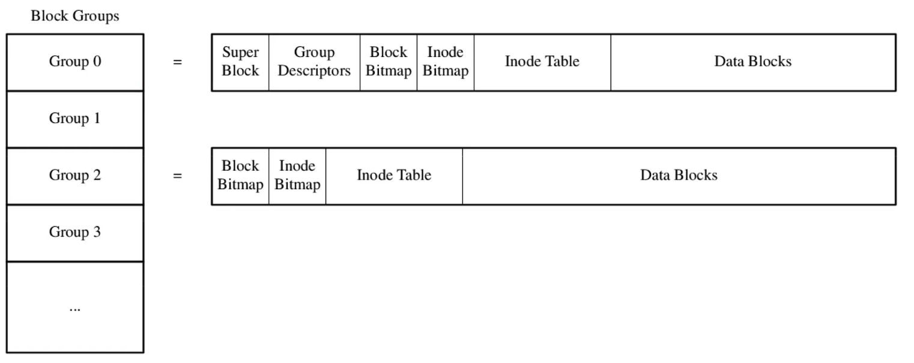
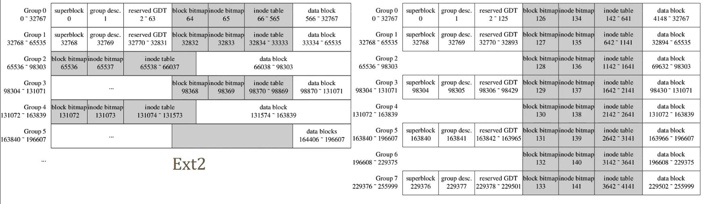

# Disk layout

## 1. 上手体验

```shell
dd if=/dev/zero of=ext2.img bs=1M count=100
mkfs.ext2 -r 0 ext2.img
dumpe2fs ext2.img
debugfs -w ext2.img
```

1. `dd if=/dev/zero of=ext2.img bs=1M count=100`
   - `dd` 是一个用于复制和转换文件的命令。
   - `if=/dev/zero` 指定输入文件为 `/dev/zero`，这是一个特殊的设备文件，提供无限的空字节流。
   - `of=ext2.img` 指定输出文件为 `ext2.img`，这将是ext2文件系统镜像文件。
   - `bs=1M` 将块大小设置为1兆字节。它定义了每次复制的数据块的大小。
   - `count=100` 指定从 `/dev/zero` 复制100个数据块到 `ext2.img`。
   - 这个命令实际上创建一个大小为100兆字节的空文件，其中所有字节都是零。
2. `mkfs.ext2 -r 0 ext2.img`
   - `mkfs.ext2` 是一个用于在设备或磁盘镜像上创建ext2文件系统的命令。
   - `-r 0` 指定创建文件系统时不为超级用户（root）保留空间。
   - `ext2.img` 是要创建ext2文件系统的镜像文件的名称。
   - 此命令在 `ext2.img` 文件上创建ext2文件系统。
3. `dumpe2fs ext2.img`
   - `dumpe2fs` 是一个用于显示有关ext2文件系统的各种信息的命令。
   - `ext2.img` 是要检查的ext2文件系统镜像文件的名称。
   - 此命令提供有关ext2文件系统的详细信息，包括块计数、索引节点计数和其他元数据。
4. `debugfs -w ext2.img`
   - `debugfs` 是一个用于ext2文件系统的调试工具，允许您以低级别与文件系统进行交互和操作。
   - `-w` 标志指定您要以写模式运行 `debugfs`，这允许您对文件系统进行更改。
   - `ext2.img` 是要调试的ext2文件系统镜像的名称。
   - 此命令以调试模式打开文件系统，您可以在其中执行各种与文件系统相关的操作。

总之，这些命令在名为 `ext2.img` 的文件中创建一个ext2文件系统镜像，使用 `dumpe2fs` 提供有关文件系统的详细信息，并使用以写模式运行的 `debugfs` 与文件系统进行交互和修改。生成的ext2文件系统是空的，不为超级用户保留空间。

## 2. Block Groups



Group1 和 Group0 的构造是一样的，是对 Group0 中的 superblock 和 Group Descriptors 做一个镜像。

xx Bitmap 只占用一个 block

- Block Bitmap 和 Inode Bitmap：用于跟踪哪些块和索引节点在块组中被使用，哪些是空闲的
- Block Group Descriptor：块组描述符是块组的元数据结构，包含有关块组的信息，如数据块的数量、索引节点的数量、空闲块的数量、块位图和索引节点位图的位置等。块组描述符表格保存在文件系统的固定位置，用于描述每个块组的信息。
- Inode Table：每个块组包含一组索引节点，每个索引节点代表文件或目录，并包含有关文件或目录的元数据信息，如文件大小、权限、所有者等。
- data block：每个块组包含一组数据块，这些块用于存储文件和目录的实际数据。

## 3. Ext2 disk layout (1KiB block,100MiB image)

- Max file system size is 4TiB, block number is 32-bit.
- Disk blocks are grouped into block groups for locality. Each group is like a mini-FS.
- Each group has 8192 blocks. why?
- Each group has 2048 inodes*.
- Group 1 has backup of superblock and group descriptors.

*typical, mkfs.ext2 inode_ratio option. online-resize is not possible: bg desc

```c
// Structure of a blocks group descriptor
struct ext2_group_desc // sizeof(*this) == 32
{
    u32 bg_block_bitmap;        //Blocks bitmap block
    u32 bg_inode_bitmap;        // Inodes bitmap block
    u32 bg_inode_table;         // Inodes table block
    u16 bg_free_blocks_count;   // Free blocks count
    u16 bg_free_inodes_count;   // Free inodes count
    u16 bg_used_dirs_count;     // Directories count
};
```

https://metebalci.com/blog/-minimum-complete-tutorial-of-linux-ext4-file-system/

## 4. Ext4 flex block group, larger contiguous space

1000 MiB,4KiB block, 256,000 blocks, 32,768 blocks per group, 8 groups (#0 ～7)256B inode, 16 inodes per block, 8000 inodes per group, 500 inode blocks per group



## 5. Locating inode struct with inode number

ino > 0, 0 is invalid value.

> group = (ino-1) / inodes_per_groupoffset_in_group = ( ino-1) % inodes_per
> group_block = group_descs[group].bg_inode_table + offset_in_group / inodes_per_block
> offset_in_block = offset_in_group % inodes_per_block
> struct ext2_inode inodes[inodes_per_block];
> dev->readBlock(block, inodes);
> return inodes[offset_in_block];

> inodes_per_group = 2048
> inodes_per_block = 8 / / 128B inode on 1KiB block
> to read ino = 12345
> group = (12345-1)/2048=6offset_in_group = 56
> group_6.bg_inode_table = 49157
> block = 49157+ 56 / 8= 49164
> readBlock(49164) to inodes[8], return inodes[0].
