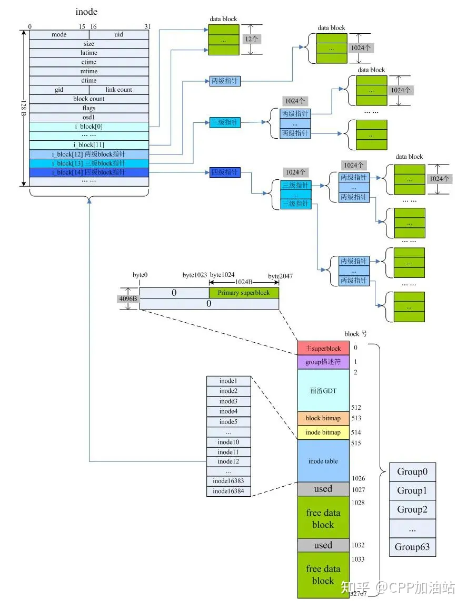

# Summary



理清楚：

- superblock
- group descriptor
- inode table
- data block
- directory

抽象最终具象为：

```c++
struct FileSystem : noncopyable
{
    explicit FileSystem(BlockDevice* dev);
    unique_ptr<File> open(string_view name, mode);
    vector<string> list(string_view dirname);
    bool remove(string_view name); // unlink
};

struct File : noncopyable
{
    ~File0; // close itint64_t size( const;
    int read(void* buf, int len);
    int write(const void* buf, int len);
    int seek(int64_t offset, whence);
    int truncate(int64_t len);
};

struct Inode 
{
    int64_t file_size;
    int16_t ref_count;
    Vector<block_num_t> blocks; // indirect blocks
};

struct Directory : public Inode 
{
    list<pair<inode_num_t, string>> entries;
};

struct Ext2FileSystem : public FileSystem 
{
    SuperBlock sb; // inode_num_t 
    root_ino _;
    vector<GroupDescriptor> groups;
    Array<Inode> inode_table;
};

struct Ext2File : public File 
{
    shared_ptr<Inode> inode;
};
```

[深入理解Linux文件系统之ext2路径名查找](https://cloud.tencent.com/developer/article/1857530)
