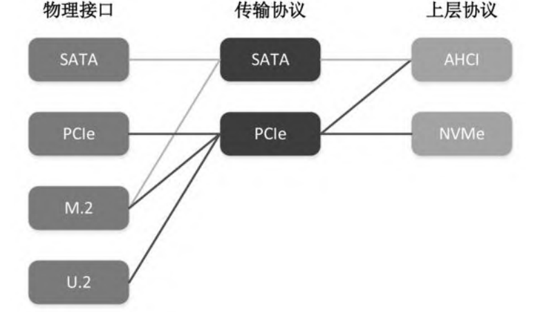

# 第二章 存储硬件与协议

## 1. 存储设备的历史轨迹

穿孔卡、磁带、硬盘、软盘、CD/DVD、U盘/移动硬盘、固态硬盘。详情可见[常见块设备](../basic_concept/block_device.md)。

## 2. 存储介质的进化

3D NAND、3D XPoint、Intel Optane

## 3. 存储接口协议的演变

## 4. 网络存储技术

详情可见常见[网络存储技术](../basic_concept/DAS_NAS_SAN.md)
