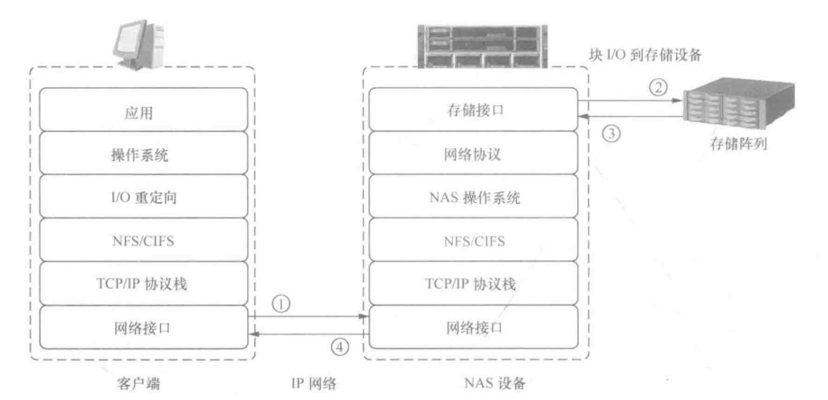
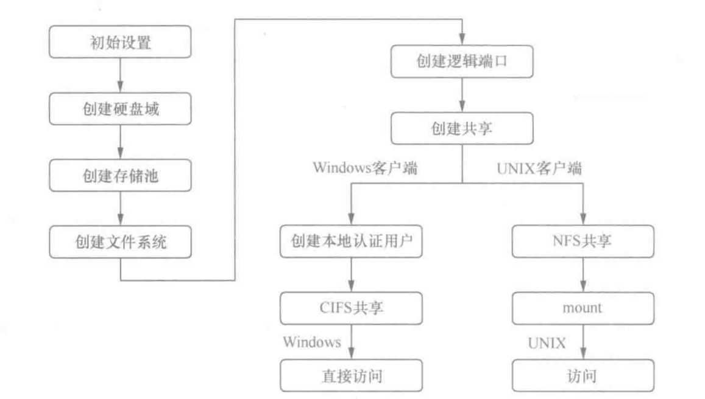
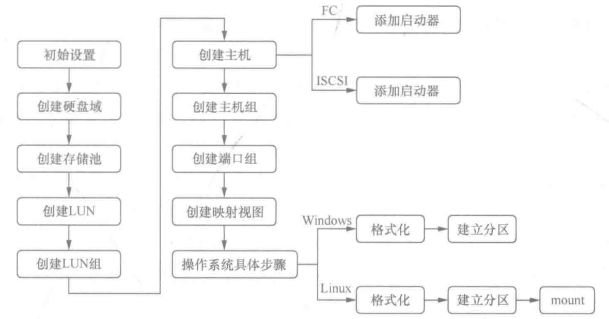
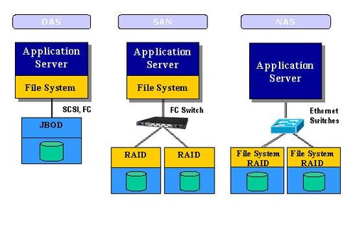

# 存储领域的一些技术名词

[TOC]

这部分参考网上博客回答、[数据存储-架构和技术]() 和 [数据存储技术](../reference/数据存储技术.pdf) 这本书

## 1. DAS

DAS 是直接附加存储（Direct Attached Storage）的缩写，它是一种存储架构，将存储设备（例如硬盘、SSD 等）直接附加到服务器或计算机上，形成本地存储，已有五十多年的历史。DAS 通常使用 SATA、光纤或 SAS 等接口连接存储设备和服务器或计算机。同时 DAS 也分为内部 DAS 或外置 DAS，而外置 DAS 包含两种存储形态：外部硬盘阵列（JBOD）和智能硬盘阵列（RAID）。

DAS 的优点包括：

1. **高性能**：由于存储设备直接附加到服务器或计算机上，因此可以获得更快的读写速度，适用于对存储性能有高要求的应用场景。
2. **简单易用**：DAS 无需额外的网络设备和协议，配置和管理较为简单。
3. **低延迟**：DAS 直接连接到服务器或计算机，无需经过网络，因此可以获得更低的数据传输延迟。
4. **高可靠性**：DAS 的存储设备通常由服务器或计算机的 RAID（Redundant Array of Independent Disks）控制器管理，提供数据冗余和容错能力，可以保证数据的可靠性和完整性。

但是，DAS 的局限性也比较明显，它只适用于单个服务器或计算机的存储需求，难以实现数据共享和集中管理。对于大规模的数据中心和企业级应用，通常采用 SAN（Storage Area Network）或 NAS（Network-Attached Storage）等存储架构。

## 2. NAS

NAS 是网络附加存储（Network-Attached Storage）的缩写，自 1983 年至今，它是一种专门用于存储和共享文件的存储设备，可以通过网络连接到多个客户端设备，提供共享文件、备份和数据管理等功能。NAS 通常包括硬件设备和嵌入式操作系统，提供基于网络的文件系统（例如 NFS、CIFS 等）和管理界面，用户可以通过浏览器或特定的客户端软件来访问和管理存储设备。

以下是关于 NAS 的一些关键信息：

1. **支持全面的获取信息**：NAS 实现高效的文件共享，既支持多个客户端同时访问一个 NAS 设备，也支持一个客户端同时连接多个 NAS 设备。
2. **高访问效率**：NAS 设备使用专用的操作系统提供文件服务，相比通用服务器的文件服务操作，NAS 设备具有更高的访问效率。
3. **高应用灵活性**：NAS 使用行业标准协议，支持 UNIX 客户端和 Windows 客户端。不同类型的客户端能够访问同一存储资源。
4. **集中式存储**：数据进行集中存储，减少客户端的数据量，简化数据管理。
5. **可扩展性**：根据不同的利用率配置和各种业务应用可提供高性能、低延迟扩展。
6. **高可用性**：NAS 设备可以使用集群技术用于故障切换。NAS 使用冗余的网络组件，提供多连接选项。NAS 还具有复制功能和恢复选项，可实现数据的高可用性。
7. **安全**：NAS 通过身份认证、文件锁定和安全架构三者相结合的方式确保数据安全性。

下图是 NAS 的 I/O 流程：

实现 NAS 存储业务配置要经过以下步骤：

硬盘域由多块相同或不同类型的硬盘组合而成，通过创建硬盘域，将物理硬盘空间组织在一起。不同的硬盘域间相互隔离，可以利用不同的硬盘域承载不同的业务，达到隔离业务之间性能影响和故障影响的效果。

存储池是存储空间资源的容器，所有应用服务器使用的存储空间都来自存储池，而存储池的存储资源来自硬盘域。硬盘域的硬盘类型决定了存储池可以创建的存储层级，例如，高性能层由SSD盘组成，性能最高;性能层由SAS盘组成，性能较高;容量层由NL-SAS盘组成，性能最低。

文件系统在存储池之上创建，因此，要先选择用于提供文件存储服务的存储池，然后再创建文件系统，通过创建存储系统可以使存储系统以文件目录的形式共享存储资源。

在创建共享前，需要先创建逻辑端口，V3 存储系统是基于逻辑端口来承载文件业务。逻辑端口可以基于物理以太网端口来创建，也可以通过绑定端口或采用 VLAN 来创建。基于物理端口创建逻辑端口时,该物理端口不能预先有 IP 地址,否则将无法创建逻辑端口。启用 IP 地址漂移后，如果主用端口失效，业务会默认被漂移组内其他可用端口接管，整个过程中业务使用的 IP 地址不变。因此，逻辑端口能够在不中断主机业务的情况下，快速将故障端口的业务切换至其他同种类型的可用端口。当故障端口恢复正常工作后，又可重新接管业务，从而保障业务的连续性。

创建共享时，需要关联可访问该共享的用户。若认证方式为本地认证，还需要创建本地认证用户。即在本地认证的应用中，本地用户用于访问共享。

文件系统只有被共享后，用户才能访问该文件系统。文件系统的共享方式主要包括：NFS 共享、CIFS 共享、FTP 共享和 HTTP 共享：

- CIFS（Common Internet File System）是微软公司开发的文件共享协议，主要应用于 Windows 操作系统环境下的文件系统共享。CIFS 共享将文件系统共享给通过认证的用户，包括本地认证用户和域认证用户，用户对 CIFS 共享拥有相应的权限。
- NFS （Network File System）是 SUN 公司开发的网络文件系统，主要应用于 Linux、UNIX、Mac 0S和  VMware 操作系统环境的文件系统共享。需要说明的是，当 Linux/UNIX 客户端通过 NFS 访问共享文件系统时，需要执行文件系统挂载操作。
- FTP（File Transfer Protocol）是 TCP/IP 网络上两台计算机之间的文件传输协议，主要应用于Internet 环境。
- HTTP （Hypertext Transfer Protocol）是用于从 WWW（World Wide Web）服务器传输超文本到本地浏览器的传送协议，主要应用于 Internet 环境。

当文件系统以各种方式共享后，用户便可以访问该共享的存储空间。

**NAS 设备可以是专用硬件，也可以是在通用硬件上运行的 NAS 软件解决方案。无论是家庭用户还是企业级用户，NAS 都可以提供高效的数据管理和共享解决方案，并在网络中实现方便的数据访问。对于大规模的数据中心和企业级应用，通常采用 SAN（Storage Area Network）等存储架构。**

## 3. SAN

SAN 是存储区域网络（Storage Area Network）的缩写，自 1993 或 1994 至今，它是一种基于高速网络的存储解决方案，用于连接存储设备和多个服务器或计算机，提供共享存储、备份和灾难恢复等功能。SAN 通常使用 Fibre Channel、iSCSI 等协议和技术，提供高速数据传输和可靠的数据保护能力。与 NAS（网络附加存储）不同，SAN 是一种**块级存储**解决方案，允许服务器通过 SAN 访问存储设备上的块级数据，而不是文件级数据，即对应 NAS 的**文件存储**。通常人们将 SAN 技术视为 DAS 技术的替代。

> 这里涉及的概念：块存储、文件存储将在另一篇 [block_file_ob_storage](../block_file_ob_storage.md) 介绍。

以下是关于 SAN 的一些关键信息：

1. **块级存储**：SAN 提供块级存储，这意味着它允许服务器访问和管理存储设备上的数据块。每个数据块可以被视为一个独立的存储单元，服务器可以读取、写入和管理这些块。
2. **高速网络**：SAN 使用高速网络技术，如光纤通道（Fibre Channel）或以太网（iSCSI），以实现快速的数据传输速度。这使得 SAN 适用于需要高性能和低延迟的应用，如数据库和虚拟化。
3. **存储共享**：SAN 允许多个服务器共享同一块存储设备。这意味着多台服务器可以同时访问和共享存储资源，而无需将数据复制到各自的本地存储中。
4. **数据管理和保护**：SAN 提供了高级的数据管理和保护功能，如数据快照、镜像和复制。这些功能有助于备份、恢复和数据保护。
5. **集中管理**：SAN 可以由专门的存储管理员进行集中管理，以确保存储资源的高可用性、性能和安全性。
6. **虚拟化**：SAN 技术通常与存储虚拟化相结合，允许多个存储设备被虚拟化为一个共享的存储池。这提高了存储资源的利用率和灵活性。
7. **企业级应用**：SAN 主要用于支持大型企业级应用，如数据库、企业资源规划（ERP）系统和虚拟服务器。它通常用于满足高性能、高可用性和数据安全性的要求。

实现 SAN 存储业务配置要经过以下步骤：

存储池是存储空间资源的容器，所有应用服务器使用的存储空间都来自于存储池，而存储池的存储资源来自于硬盘域。因此，首先需要创建一个硬盘域，将物理硬盘空间组织在一起。硬盘域可以由多块相同或不同类型的硬盘组合而成，不同的硬盘域相互隔离，如果将不同的业务承载到不同硬盘域中，可以达到隔离业务之间性能影响和故障影响的目的。

应用服务器使用的存储空间来自于存储系统的存储池，存储池从硬盘域中划分出来，每个硬盘域都可以划分成一个或多个存储池。存储池是硬盘域中一个或多个存储层的逻辑组合，不同存储层可以配置不同的 RAID 策略，RAID 策略包含 RAID 级别以及组成 RAID 级别的数据块和校验块的个数。管理员在创建存储池的时候,需要考虑后续创建 LUN 的使用场景。

成功创建存储池后，存储池的存储空间尚不能被主机识别。只有将存储池中的存储空间划分为多个逻辑单元（LUN），并将 LUN 映射给主机后，主机才能使用分配给它的存储空间。LUN 的 RAID 保护策略和存储池相同。在存储池中可以创建 Thick LUN 和 Thin LUN 。Thick LUN 的特点是预先从存储池中分配满额的存储容量，即使 ThickLUN 没有存储任何用户数据，它也会占用 Thick LUN 大小的存储空间；而 Thin LUN 不会预先从存储池中分配满额的存储空间，它是在创建时预先分配一部分存储空间，剩余的空间根据用户写入的数据量从存储池中按需进行分配。Thin LUN 相关内容可参看 [数据存储技术](../reference/数据存储技术.pdf) 第8章的自动精简配置技术。

为了便于管理，主机使用 LUN 时，必须将 LUN 加入到 LUN 组中。一个LUN 组可以包含一个或多个 LUN，同一个 LUN 也能添加到多个 LUN 组中。通过为 LUN 组和主机组建立映射关系，主机组中的主机就能使用 LUN 组中的 LUN。

为了建立存储设备与应用服务器的连接，需要先在存储设备上创建主机，用这个虚拟的主机来表示远端的应用服务器。因此，要为主机添加启动器（Initiator），启动器号是远端物理服务器的唯一标识，通过给主机添加对应的启动器，才能建立存储虚拟主机和物理应用服务器的对应关系。创建主机时可以设置主机的基本信息，如果主机与存储之间通过 iSCSI 链路连接，建议输入相关描述信息，并且输入主机真实 IP 地址，此 IP 地址仅用于标记，便于管理员管理维护，无实际意义。

主机通过增加的启动器来访问存储资源，若主机与存储通过 FC 链路连接，启动器是主机的 HBA 卡上的端口，目标器是存储设备上与主机传输数据的端口。

同样地，为了使主机能使用LUN，需将主机加入到主机组中。一个主机组可以包含一个或多个主机，一个主机也可以添加给一个或多个主机组。通过为LUN组和主机组建立映射关系，能实现主机组中的主机使用LUN组中的LUN。

创建主机组时，选择要添加到主机组的主机，一个 LUN 可以同时映射给多台主机，如果添加给主机组的多个主机不属于同一集群，可能导致数据访问冲突，造成数据丢失。因此，若将 LUN 映射给主机，需要确保主机组内只有一台主机。若有多台主机，在执行该操作前，确保主机安装了集群软件并且组成了集群，避免出现数据丢失问题。

建立 LUN 组和主机组的映射时，也可以选择对应的端口组。端口组是个可选项，它是指将多个物理端口在逻辑上创建的一个组合，存储系统使用指定端口的方式建立存储资源和服务器之间的对应关系。通过创建端口组并将其加入到映射视图，指定 LUN 组中的 LUN 与主机组对应的主机就能使用特定的端口进行通信。否则，存储系统将采用随机分配的可用端口进行通信。

将 LUN 组和主机组通过创建映射视图的方式关联起来，根据映射视图使用端口的不同，可以将映射视图分为主机映射和端口映射。主机映射即为LUN Masking，它指的是LUN与主机端口的 WWPN 地址绑定，与主机端口建立一对一或多对一的连接和访问关系。无论主机连接存储的哪一个端口，主机都能识别到相同的 LUN。端口映射即为 LUN Mapping，其指的是 LUN 与存储设备的前端端口进行绑定，主机连接不同的前端端口时所能访问的 LUN 不同。

完成存储侧的配置，且存储系统与应用服务器建立连接后，便可以通过在应用服务器上执行硬盘扫描操作来发现新增的硬盘，然后执行格式化操作，格式化之后可以将该 LUN 对应的存储空间视为普通硬盘，在操作系统下对其进行读/写操作。

一般物理主机使用 FC 或者 iSCSI 协议通过交换机连接到存储网络。使用 iSCSI 协议，主机检测新 LUN 的方法与 FC 协议有所不同。当使用 iSCSI 协议映射 LUIN 到主机时，首先需要使用 iSCSI initiator 软件将 LUN 连接到操作系统。若应用服务器与存储系统通信正常，则可以建立启动器与目标器的连接，建立连接后，可以通过 iSCSl initiator 软件发现目标的状态为已连接;当使用 FC 协议映射 LUN 到主机操作系统时，一旦创建了映射视图，LUN 就立即连接到了操作系统。不管是基于 iSCSI 协议，还是基于 FC 协议，连接到主机操作系统的 LUN，都要经过磁盘管理器的处理之后，Windows 操作系统才能实现对 LUN 的数据存取。

新映射的 LUN 将显示在磁盘管理器中（该磁盘尚未初始化），对新增的逻辑磁盘进行初始化，并选择磁盘分区形式，用户便可以对该分区进行高级格式化，即创建文件系统。文件系统创建完成后便可以供操作系统使用，运行在主机上的应用程序可以选择该卷来存储数据。

Linux 操作系统主机使用 FC 或者 iSCSI 协议通过交换机连接到存储网络时操作系统发现新 LUN 的操作与 Windows 操作系统不同。以 RedHat 应用服务器为例。当使用 iSCSI 协议映射 LUN 到主机时，同样需要先使用 iSCSI initiator 将LUN连接到操作系统。

**总之，SAN 是一种专门用于存储和服务器之间高速数据传输的网络架构。它为企业级应用提供了可扩展性、性能和数据保护，使多个服务器能够有效地访问和共享存储资源。SAN 技术在大型数据中心和企业级环境中广泛应用。**

## 4. SAN 和 NAS 对比

SAN（存储区域网络）和 NAS（网络附加存储）是两种不同的存储架构，它们在数据存储和访问方式上有一些重要的区别。以下是 SAN 和 NAS 的主要对比：

1. **数据访问级别**：
   - SAN：SAN 提供块级存储，允许服务器以块（通常是512字节到数MB大小的块）的方式读取和写入数据。这意味着服务器将数据视为块级别的逻辑单元，不直接处理文件系统。
   - NAS：NAS 提供文件级存储，允许服务器通过文件共享协议（如SMB或NFS）访问和管理存储设备上的文件和文件夹。这使得服务器可以像访问本地文件系统一样访问存储资源。
2. **访问性能**：
   - SAN：SAN 采用专用的存储网络，不占用 LAN 带宽资源，提高传输性能。
   - NAS：NAS 与业务应用共享网络，占用 LAN 网络带宽资源，既影响业务，也限制 NAS 传输能力。
3. **通信协议**：
   - SAN：SAN 使用高速存储协议，如光纤通道（Fibre Channel）或以太网（iSCSI）来传输**块级数据**。这些协议通常提供高性能、低延迟的数据传输。
   - NAS：NAS 使用文件共享协议，如 SMB（在Windows环境中）或 NFS（在UNIX/Linux环境中）来传输**文件级数据**。这些协议在文件共享和访问方面非常方便。
4. **适用场景**：
   - SAN：SAN 主要用于需要高性能、低延迟和高可用性的应用，如数据库、虚拟化、企业级应用和大规模数据中心。
   - NAS：NAS 适用于需要共享文件数据的环境，如文件共享、协作、备份、多媒体和小型至中型企业。
5. **数据管理**：
   - SAN：SAN 提供高级的数据管理和保护功能，如数据快照、镜像和复制，以及块级级别的存储虚拟化。
   - NAS：NAS 通常提供较简单的数据管理功能，适用于文件级别的操作。
6. **部署和管理**：
   - SAN：SAN 部署和管理通常需要专业知识，包括存储管理员的参与。它通常较复杂，但也提供了高度的配置和控制。
   - NAS：NAS 部署和管理相对较简单，可以由一般 IT 管理员处理。它通常更容易设置和维护。
7. **成本**：
   - SAN：SAN 通常更昂贵，因为它需要专用硬件和存储协议，以及专业知识来管理。
   - NAS：NAS 通常更经济实惠，因为它可以在通用硬件上实现，并且更容易部署和管理。

**总结来说，SAN 和 NAS 都是有效的存储解决方案，但它们适用于不同的使用情境。SAN 适用于需要高性能、块级存储和高可用性的应用，而 NAS 适用于需要文件共享和相对简单数据管理的场景。选择哪种存储架构取决于您的具体需求和预算。有时，组合使用 SAN 和 NAS 可以满足多种需求。**
