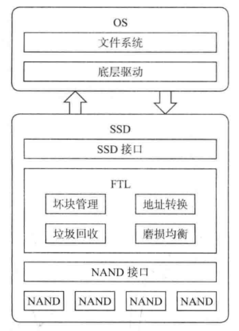
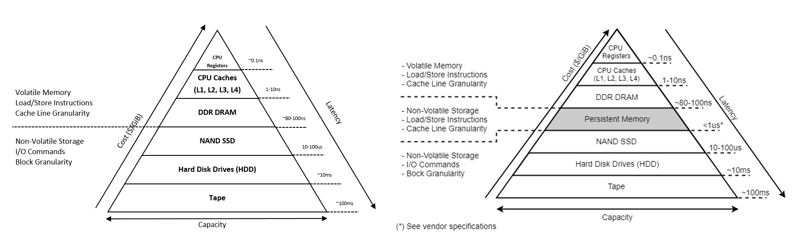

# 存储领域常听到的块设备

[TOC]

## 前提：HDD,SMR-HDD,SSD,ZNS SSD

默认已了解相关基础内容：

- [HDD](https://www.bilibili.com/video/BV1Bh4y1x7tv/?spm_id_from=333.999.0.0)
- [SMR-HDD](https://www.bilibili.com/video/BV1Bh4y1x7tv/?spm_id_from=333.999.0.0)
- [SSD](https://space.bilibili.com/1778586949/channel/collectiondetail?sid=212121)，同时附加 [深入浅出 SSD](./reference/深入浅出SSD%20%20固态存储核心技术、原理与实战_14443017.pdf) 的前三章和 [数据存储技术](./reference/数据存储技术.pdf) 的第二章，胡洋博士的[论文](./reference/高性能固态盘的多级并行性及算法研究_胡洋.caj) 对 SSD 并行性的剖析很深刻。
- [ZNS SSD](https://zonedstorage.io/docs/getting-started/zns-device)

## 1. PCIe

PCIe（Peripheral Component Interconnect Express）是一种用于计算机内部的高速串行总线标准，用于连接主板上的各种扩展卡和外设，例如图形处理器（GPU）、固态硬盘（SSD）、网卡、音频卡和 USB 卡等。PCIe 提供了许多高级特性，其中包括**多队列机制**和**虚拟化技术**。PCIe 总线通常采用基于点对点连接的架构，每个设备都有自己的专用通信通道，以实现高速数据传输和低延迟。

PCIe 总线标准的发展历史可以追溯到 20 世纪 90 年代，当时计算机系统中的传统 ISA 和 PCI 总线已经无法满足不断增长的带宽需求。PCIe 标准最早由英特尔公司于 2003 年推出，它采用了串行点对点连接的架构，通过高速数据传输和多队列命令传输机制，以实现更快的数据传输速度和更高的并发性能。随着时间的推移，PCIe 总线标准不断发展和升级，例如 PCIe 2.0、PCIe 3.0 和 PCIe 4. 0 等版本，每个版本都带来了更高的带宽和更低的延迟，以满足不断增长的计算需求。

PCIe 总线广泛用于各种计算机系统和设备中，例如个人电脑、工作站、服务器、移动设备和嵌入式系统等。在固态硬盘（SSD）领域，PCIe 接口已成为高性能固态硬盘的主流接口，例如 NVMe SSD 和 U.2 SSD 等。

PCIe 这一部分主要可以分为：接口对比和基本原理。现在我们简单的介绍一下 SATA、SAS 和 PCIe 接口，每个接口又对应相应的物理通信协议。首先我们先观察 SSD 系统调用。

可以看出，SSD 主要有三大功能模块组成:

- 前端接口和相关的协议模块;
- 中间的 FTL 层（Flash Translation Layer）模块;
- 后端和闪存通信模块。

SSD 前端负责和主机直接通信，接收主机发来的命令和相关数据，命令经 SSD 处理后，最终交由前端返回命令状态或数据给主机。SSD 通过诸如 SATA、SAS 和  PCIe 等接口与主机相连，实现对应的 ATA、SCSI 和 NVMe 等协议（SSD 和 host 通信），如表所示。

| 接口 | 协议命令 | 主机控制器接口 | 标准组织 |
| :---: | :---: | :---: | :---: |
| SATA | ATA/SATA 命令集 | AHCI (Advanced Host Controller Interface) | ATA-IO |
| SAS | SCSI 命令集 | SCSI | T10 of INCITS |
| PCIe | NVMe 命令集 | NVMe | PCIExpress/NVM Express |

PCIe 本质上是全双工模式，而 SATA 是半双工模式。具体内容可以参考 [深入浅出 SSD](./reference/深入浅出SSD%20%20固态存储核心技术、原理与实战_14443017.pdf) 的第五章。在本章可以了解 PCIe 的树形拓扑结构和 PCIe 协议的分层结构，会让你对 host 与设备端的通信有一个新的认识。

## 2. NVM

在过去的几十年里，计算机系统已经实现了如下图左部分所示的内存存储层次结构。存储器存储层次结构利用局部性原理，使频繁访问的数据最接近CPU。一代又一代的技术对缓存的数量、大小和速度进行了迭代，以确保CPU能够访问最频繁使用的数据。CPU速度持续加快，每一代新的CPU都会增加更多的内核和线程，以保持摩尔定律。易失性DRAM和非易失性存储（如NAND SSD或硬盘驱动器）的容量、价格和速度没有跟上步伐，并迅速成为系统和应用程序性能的瓶颈。

"NVM" 在计算机领域通常指的是"Non-Volatile Memory"，非易失性内存，也被称为"Persistent Memory"（PM），即持久性内存。在上图右部分所示的存储器存储层次结构中提供了一个新条目，填补了性能/容量缺口。它是一种特殊类型的存储介质，具有与内存相似的访问速度，同时又能够在断电情况下保持数据的持久性。

Persistent Memory 具有以下特点：

- **速度和持久性**：与传统的硬盘和固态硬盘不同，Persistent Memory 具有接近内存的读取和写入速度，同时能够在断电情况下保持数据的持久性，类似于传统的存储介质。

- **字节寻址**：与传统硬盘和 SSD 以块为单位的访问方式不同，Persistent Memory 允许以字节为单位进行访问，这使得它在一些特定应用中具有更好的灵活性。

- **应用场景**：Persistent Memory 在诸如数据库、缓存、日志、文件系统等需要快速访问和持久性存储的应用场景中表现出色。它可以减少数据在内存和存储设备之间的复制，提高系统性能。

- **内存和存储的融合**：由于其速度和持久性特点，Persistent Memory 模糊了内存和存储之间的界限，将二者进行了有机融合。这为新型的内存层次结构和应用提供了机会和挑战。

- **软件优化和适配**：虽然 Persistent Memory 具有高速和持久性的特点，但需要操作系统、文件系统和应用程序进行适当的优化，以充分发挥其性能和特性。

总之，Persistent Memory 是一种创新的存储介质，结合了内存和存储的特点，适用于需要高速访问和持久性数据的应用。它是计算机领域中的一个重要发展方向，有望在存储技术和应用中引起重要变革。

## 3. NVMe, NVMe SSD

在 [深入浅出 SSD](./reference/深入浅出SSD%20%20固态存储核心技术、原理与实战_14443017.pdf) 第六章中较为详细的描述了 NVMe 协议，I/O 数据经过 NVMe 协议封装后，做为 PCIe 协议的数据部分，再经 PCIe 协议封装和解封，这里类似计算机网络的分层结构，如果这时数据流要经过 PCIe switch，其作用也是类似于计算机网络中的交换机作用。

### 3.1 NVMe 定义

NVMe（Non-Volatile Memory Express）是一种高性能、低延迟的存储接口协议，旨在加速闪存存储器（如 SSD）和其他非易失性存储器（NVM）设备的数据传输。相比于传统的存储接口协议（如 SATA 和 SAS），NVMe 利用 PCIe 总线的高带宽和低延迟，以及更优化的命令传输和队列管理方式，可以大幅提升SSD的性能和响应速度。

NVMe 协议针对固态硬盘的特点进行了优化，采用多队列、多核心的架构，可以更好地发挥 SSD 的并行性能。与 SATA 和 SAS 等传统存储接口相比，NVMe 可以提供更高的数据传输速率和更低的延迟。此外，NVMe 还提供了一系列高级功能，如队列优先级、统计信息、错误检测和修复等，可以提高系统的可靠性和稳定性。

NVMe 协议采用了多队列和多核心架构，以提高闪存设备的并行性和吞吐量。具体来说，NVMe中的多队列和多核心架构包括以下几个要素：

1. **多个队列**：NVMe 支持多个命令队列，每个队列都有独立的指令和状态，可以并行处理多个读写请求。通过多个队列的方式，可以避免单个队列的瓶颈问题，提高系统的并发能力。
2. **多个核心**：NVMe 控制器中的多个核心可以同时访问存储设备的多个物理通道（如 PCIe 通道），以及闪存芯片的多个芯片通道。每个核心可以独立处理命令队列，以提高系统的吞吐量。
3. **双向命令队列**（Submission Queue 和 Completion Queue）：NVMe 中的命令队列是双向的，即可以同时接收请求和发送响应。这种架构可以避免 CPU 和存储设备之间的等待，提高系统的效率和性能。In NVMe, the controller maintains one or more queues of commands. Each queue consists of two parts: the submission queue (SQ) and the completion queue (CQ), which are allocated in host memory. The SQs are used by the host to submit commands to the NVMe device, while the CQs are used by the device to return completion status for those commands. These paired, parallel queues are the interface between the NVMe driver and the NVMe controller, which manage them cooperatively.

通过多队列和多核心的架构，NVMe 可以更好地发挥闪存设备的并行性能，提高存储系统的吞吐量和响应速度。此外，NVMe 协议还提供了多种高级功能，如优先级队列、中断协调等，可以进一步提高系统的可靠性和稳定性。

总的来说，NVMe 是一种针对 SSD 和其他 NVM 设备的高性能存储接口协议，可以大幅提升存储设备的性能和响应速度，同时提供更高的可靠性和稳定性。随着 NVMe 技术的不断成熟和普及，越来越多的计算机和数据中心正在采用 NVMe 存储设备来提升数据处理速度和效率。

### 3.2 NVMe 工作流程

NVMe 协议的工作流程通常如下：

1. **初始化**：主机通过 PCIe 接口将 NVMe 控制器与 SSD 连接起来，并发送初始化命令进行 NVMe 控制器的初始化。
2. **请求队列初始化**：主机通过初始化命令初始化请求队列，包括指定队列的数量、队列大小、队列地址等信息。
3. **数据传输**：主机通过写命令将数据写入到 SSD 中，或通过读命令从 SSD 中读取数据。在数据传输之前，主机需要先向 NVMe 控制器提交一个 I/O 请求，其中包括读写命令、LBA（逻辑块地址）、数据传输长度等信息。
4. **NVMe 控制器处理**：NVMe 控制器接收到主机的 I/O 请求后，会将请求添加到提交队列中，等待处理。NVMe 控制器通过命令协议解析器将 I/O 请求解析成 NVMe 命令，然后通过存储协议引擎将命令发送给 SSD。
5. **SSD 处理**：SSD 接收到 NVMe 命令后，根据命令中的 LBA 以及命令类型执行相应的操作，比如读取或写入数据。
6. **数据返回**：SSD 执行完操作后，将数据返回给 NVMe 控制器，再由 NVMe 控制器将数据返回给主机。
7. **请求完成**：NVMe 控制器完成 I/O 请求后，将结果添加到完成队列中，等待主机的查询。主机可以通过轮询或中断方式查询完成队列，获取I/O请求的执行结果。

总的来说，NVMe 协议的工作流程涉及到主机、NVMe 控制器、SSD 之间的通信和数据传输，通过高效的命令协议和存储协议，实现了高性能、低延迟的数据访问。

### 3.3 NVMe SSD

NVMe SSD 是一种使用 NVMe 协议的固态硬盘，通常具有更高的读写速度和更低的延迟，以及更高的 IOPS 和吞吐量。与传统的SATA接口固态硬盘相比，NVMe SSD 采用更快的 PCIe 总线，并采用基于队列的命令传输机制，以支持并发读写操作和多核心处理。

因此，可以将 NVMe 视为一种技术标准和协议，而 NVMe SSD 是一种采用该标准和协议的固态硬盘产品。NVMe SSD 是目前市场上最快的固态硬盘之一，已被广泛用于高性能计算、企业服务器、云计算和游戏等领域。

### 3.4 multi-stream SSD
