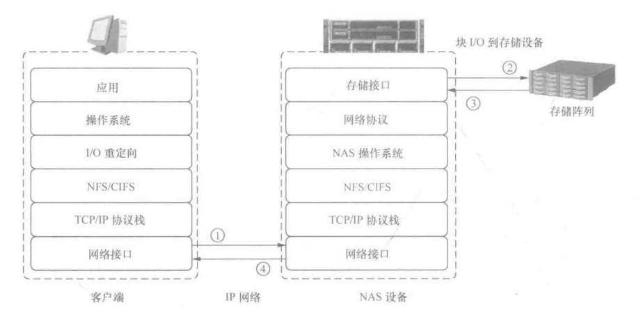
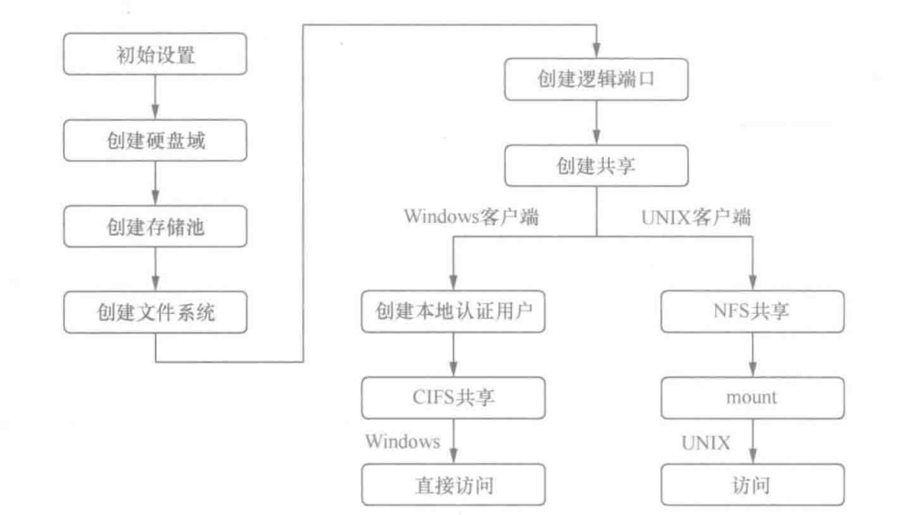
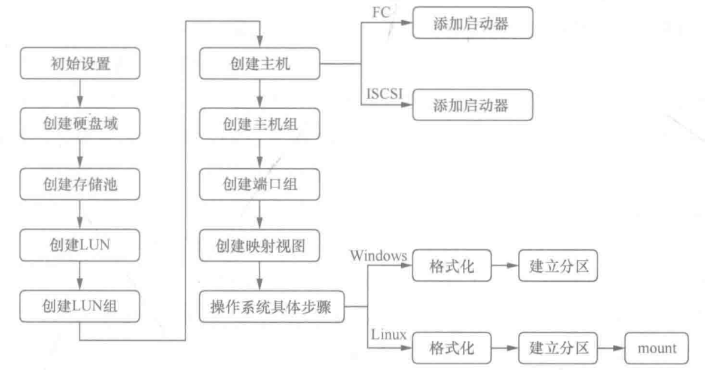

# 存储领域的一些技术名词

[TOC]

## 4. DAS, SAN, NAS

这部分参考网上博客回答和 [数据存储技术](./reference/数据存储技术.pdf) 这本书

### 4.1 DAS

DAS 是直接附加存储（Direct Attached Storage）的缩写，它是一种存储架构，将存储设备（例如硬盘、SSD 等）直接附加到服务器或计算机上，形成本地存储，已有五十多年的历史。DAS 通常使用 SATA、光纤或 SAS 等接口连接存储设备和服务器或计算机。同时 DAS 也分为内部 DAS 或外置 DAS，而外置 DAS 包含两种存储形态：外部硬盘阵列（JBOD）和智能硬盘阵列（RAID）。

DAS 的优点包括：

1. **高性能**：由于存储设备直接附加到服务器或计算机上，因此可以获得更快的读写速度，适用于对存储性能有高要求的应用场景。
2. **简单易用**：DAS 无需额外的网络设备和协议，配置和管理较为简单。
3. **低延迟**：DAS 直接连接到服务器或计算机，无需经过网络，因此可以获得更低的数据传输延迟。
4. **高可靠性**：DAS 的存储设备通常由服务器或计算机的 RAID（Redundant Array of Independent Disks）控制器管理，提供数据冗余和容错能力，可以保证数据的可靠性和完整性。

但是，DAS 的局限性也比较明显，它只适用于单个服务器或计算机的存储需求，难以实现数据共享和集中管理。对于大规模的数据中心和企业级应用，通常采用 SAN（Storage Area Network）或 NAS（Network-Attached Storage）等存储架构。

### 4.2 NAS

NAS 是网络附加存储（Network-Attached Storage）的缩写，自 1983 年至今，它是一种专门用于存储和共享文件的存储设备，可以通过网络连接到多个客户端设备，提供共享文件、备份和数据管理等功能。NAS 通常包括硬件设备和嵌入式操作系统，提供基于网络的文件系统（例如 NFS、CIFS 等）和管理界面，用户可以通过浏览器或特定的客户端软件来访问和管理存储设备。

以下是关于 NAS 的一些关键信息：

1. **支持全面的获取信息**：NAS 实现高效的文件共享，既支持多个客户端同时访问一个 NAS 设备，也支持一个客户端同时连接多个 NAS 设备。
2. **高访问效率**：NAS 设备使用专用的操作系统提供文件服务，相比通用服务器的文件服务操作，NAS 设备具有更高的访问效率。
3. **高应用灵活性**：NAS 使用行业标准协议，支持 UNIX 客户端和 Windows 客户端。不同类型的客户端能够访问同一存储资源。
4. **集中式存储**：数据进行集中存储，减少客户端的数据量，简化数据管理。
5. **可扩展性**：根据不同的利用率配置和各种业务应用可提供高性能、低延迟扩展。
6. **高可用性**：NAS 设备可以使用集群技术用于故障切换。NAS 使用冗余的网络组件，提供多连接选项。NAS 还具有复制功能和恢复选项，可实现数据的高可用性。
7. **安全**：NAS 通过身份认证、文件锁定和安全架构三者相结合的方式确保数据安全性。

下图是 NAS 的 I/O 流程：

NAS 设备可以是专用硬件，也可以是在通用硬件上运行的 NAS 软件解决方案。无论是家庭用户还是企业级用户，NAS 都可以提供高效的数据管理和共享解决方案，并在网络中实现方便的数据访问。对于大规模的数据中心和企业级应用，通常采用 SAN（Storage Area Network）等存储架构。

### 4.3 SAN

SAN 是存储区域网络（Storage Area Network）的缩写，自 1993 或 1994 至今，它是一种基于高速网络的存储解决方案，用于连接存储设备和多个服务器或计算机，提供共享存储、备份和灾难恢复等功能。SAN 通常使用 Fibre Channel、iSCSI 等协议和技术，提供高速数据传输和可靠的数据保护能力。与 NAS（网络附加存储）不同，SAN 是一种**块级存储**解决方案，允许服务器通过 SAN 访问存储设备上的块级数据，而不是文件级数据，即对应 NAS 的**文件存储**。通常人们将 SAN 技术视为 DAS 技术的替代。

> 这里涉及的概念：块存储、文件存储将在后面 [第 5 节](#5-块存储文件存储和对象存储) 介绍。

以下是关于 SAN 的一些关键信息：

1. **块级存储**：SAN 提供块级存储，这意味着它允许服务器访问和管理存储设备上的数据块。每个数据块可以被视为一个独立的存储单元，服务器可以读取、写入和管理这些块。
2. **高速网络**：SAN 使用高速网络技术，如光纤通道（Fibre Channel）或以太网（iSCSI），以实现快速的数据传输速度。这使得 SAN 适用于需要高性能和低延迟的应用，如数据库和虚拟化。
3. **存储共享**：SAN 允许多个服务器共享同一块存储设备。这意味着多台服务器可以同时访问和共享存储资源，而无需将数据复制到各自的本地存储中。
4. **数据管理和保护**：SAN 提供了高级的数据管理和保护功能，如数据快照、镜像和复制。这些功能有助于备份、恢复和数据保护。
5. **集中管理**：SAN 可以由专门的存储管理员进行集中管理，以确保存储资源的高可用性、性能和安全性。
6. **虚拟化**：SAN 技术通常与存储虚拟化相结合，允许多个存储设备被虚拟化为一个共享的存储池。这提高了存储资源的利用率和灵活性。
7. **企业级应用**：SAN 主要用于支持大型企业级应用，如数据库、企业资源规划（ERP）系统和虚拟服务器。它通常用于满足高性能、高可用性和数据安全性的要求。

实现 SAN 存储业务配置要经过以下步骤：

存储池是存储空间资源的容器，所有应用服务器使用的存储空间都来自于存储池，而存储池的存储资源来自于硬盘域。因此，首先需要创建一个硬盘域，将物理硬盘空间组织在一起。硬盘域可以由多块相同或不同类型的硬盘组合而成，不同的硬盘域相互隔离，如果将不同的业务承载到不同硬盘域中，可以达到隔离业务之间性能影响和故障影响的目的。

应用服务器使用的存储空间来自于存储系统的存储池，存储池从硬盘域中划分出来，每个硬盘域都可以划分成一个或多个存储池。存储池是硬盘域中一个或多个存储层的逻辑组合，不同存储层可以配置不同的 RAID 策略，RAID 策略包含 RAID 级别以及组成 RAID 级别的数据块和校验块的个数。管理员在创建存储池的时候,需要考虑后续创建 LUN 的使用场景。

成功创建存储池后，存储池的存储空间尚不能被主机识别。只有将存储池中的存储空间划分为多个逻辑单元（LUN），并将 LUN 映射给主机后，主机才能使用分配给它的存储空间。LUN 的 RAID 保护策略和存储池相同。在存储池中可以创建 Thick LUN 和 Thin LUN 。Thick LUN 的特点是预先从存储池中分配满额的存储容量，即使 ThickLUN 没有存储任何用户数据，它也会占用 Thick LUN 大小的存储空间；而 Thin LUN 不会预先从存储池中分配满额的存储空间，它是在创建时预先分配一部分存储空间，剩余的空间根据用户写入的数据量从存储池中按需进行分配。Thin LUN 相关内容可参看 [数据存储技术](./reference/数据存储技术.pdf) 第8章的自动精简配置技术。

总之，SAN 是一种专门用于存储和服务器之间高速数据传输的网络架构。它为企业级应用提供了可扩展性、性能和数据保护，使多个服务器能够有效地访问和共享存储资源。SAN 技术在大型数据中心和企业级环境中广泛应用。

### 4.4 SAN 和 NAS 对比

SAN（存储区域网络）和 NAS（网络附加存储）是两种不同的存储架构，它们在数据存储和访问方式上有一些重要的区别。以下是 SAN 和 NAS 的主要对比：

1. **数据访问级别**：
   - SAN：SAN 提供块级存储，允许服务器以块（通常是512字节到数MB大小的块）的方式读取和写入数据。这意味着服务器将数据视为块级别的逻辑单元，不直接处理文件系统。
   - NAS：NAS 提供文件级存储，允许服务器通过文件共享协议（如SMB或NFS）访问和管理存储设备上的文件和文件夹。这使得服务器可以像访问本地文件系统一样访问存储资源。
2. **访问性能**：
   - SAN：SAN 采用专用的存储网络，不占用 LAN 带宽资源，提高传输性能。
   - NAS：NAS 与业务应用共享网络，占用 LAN 网络带宽资源，既影响业务，也限制 NAS 传输能力。
3. **通信协议**：
   - SAN：SAN 使用高速存储协议，如光纤通道（Fibre Channel）或以太网（iSCSI）来传输**块级数据**。这些协议通常提供高性能、低延迟的数据传输。
   - NAS：NAS 使用文件共享协议，如 SMB（在Windows环境中）或 NFS（在UNIX/Linux环境中）来传输**文件级数据**。这些协议在文件共享和访问方面非常方便。
4. **适用场景**：
   - SAN：SAN 主要用于需要高性能、低延迟和高可用性的应用，如数据库、虚拟化、企业级应用和大规模数据中心。
   - NAS：NAS 适用于需要共享文件数据的环境，如文件共享、协作、备份、多媒体和小型至中型企业。
5. **数据管理**：
   - SAN：SAN 提供高级的数据管理和保护功能，如数据快照、镜像和复制，以及块级级别的存储虚拟化。
   - NAS：NAS 通常提供较简单的数据管理功能，适用于文件级别的操作。
6. **部署和管理**：
   - SAN：SAN 部署和管理通常需要专业知识，包括存储管理员的参与。它通常较复杂，但也提供了高度的配置和控制。
   - NAS：NAS 部署和管理相对较简单，可以由一般 IT 管理员处理。它通常更容易设置和维护。
7. **成本**：
   - SAN：SAN 通常更昂贵，因为它需要专用硬件和存储协议，以及专业知识来管理。
   - NAS：NAS 通常更经济实惠，因为它可以在通用硬件上实现，并且更容易部署和管理。

总结来说，SAN 和 NAS 都是有效的存储解决方案，但它们适用于不同的使用情境。SAN 适用于需要高性能、块级存储和高可用性的应用，而 NAS 适用于需要文件共享和相对简单数据管理的场景。选择哪种存储架构取决于您的具体需求和预算。有时，组合使用 SAN 和 NAS 可以满足多种需求。

## 5. 块存储、文件存储和对象存储

### 5.1 基本介绍

文件、块和对象是三种以不同的方式来保存、整理和呈现数据的存储格式。这些格式各有各的功能和限制。

文件存储会以文件和文件夹的层次结构来整理和呈现数据；

块存储会将数据拆分到任意划分且大小相同的卷中；

对象存储会管理数据并将其链接至关联的元数据。

### 5.2 文件存储

### 5.3 块存储

### 5.4 对象存储
